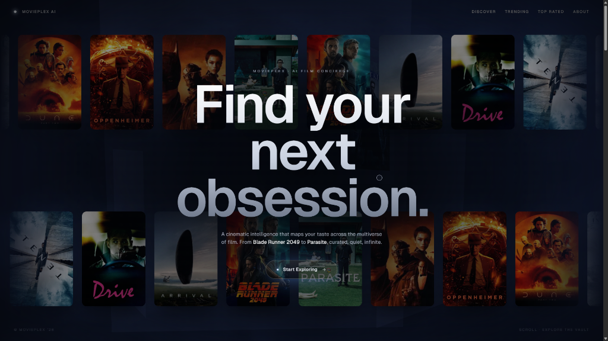
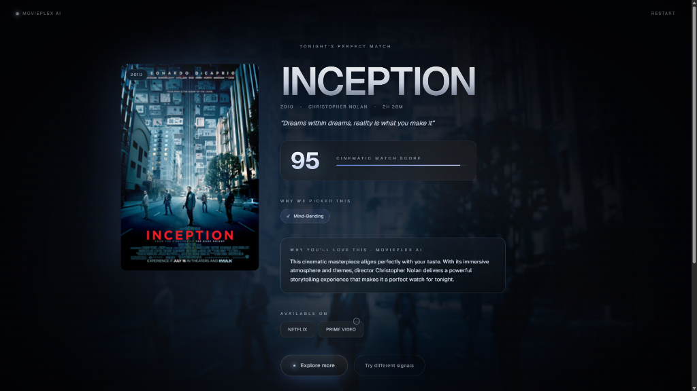
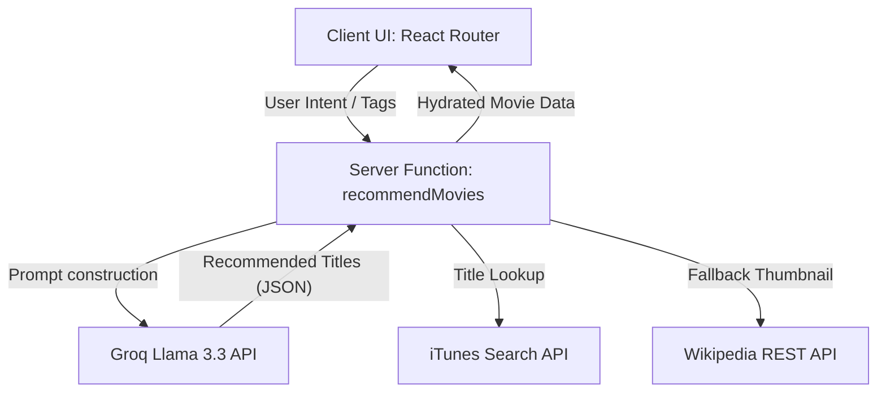

# MoviePlex AI

An immersive AI-powered film concierge. Curated, cinematic, infinite.

MoviePlex AI maps your personal taste dimensions against the multiverse of film. Using an elite 3D spatial interface, custom procedural shaders, and generative AI models, the app recommendation engine resolves the perfect movie selection for any mood or custom text signal.

**🔗 Links:**

[](https://movieplex-ai.vercel.app)
[](https://kdvhmvy9l6gqbosc.public.blob.vercel-storage.com/movieplex.mp4)

---

## Features

- **3D Spatial Carousel**: A custom interactive cylindrical poster ring built in Three.js and React Three Fiber that spins, zooms, and spotlight-focuses on movies.
- **Procedural Nebula Shader**: Dynamic canvas backdrop elements animated using custom GLSL shaders.
- **AI-Powered Recommendation Engine**: Generative text reasoning and title search matching moods and queries using Groq's Llama 3.3.
- **Dynamic Artwork Scraping**: Automated, keyless lookup querying Apple's iTunes Search API and Wikipedia REST summary interfaces to resolve high-res movie posters.
- **Taste Constellation**: An interactive SVG constellation grid that updates and highlights stars according to the user's local search history.
- **Taste Profile Metrics**: Synced progress indicators measuring category weights (e.g. Sci-Fi, Mind-Bending, Emotional).
- **Responsive & Accessible Design**: Hand-crafted micro-animations, custom cursor magnetics, smooth layout transitions, and device break compatibility.

---

## Tech Stack

- **Frontend & Routing**: React 19, TanStack Start, TanStack Router (file-based routing)
- **3D Graphics**: Three.js, React Three Fiber (R3F), React Three Drei
- **Styling & Theme**: Tailwind CSS v4 (CSS-first engine), Framer Motion, Vanilla CSS
- **API Fetching & Middleware**: TanStack Query (`@tanstack/react-query`), Nitro Server Engine
- **AI Integrations**: Groq API (`llama-3.3-70b-versatile` model)
- **State Management**: React Context & local storage caching

---

## Installation

### Prerequisites
Make sure you have Node.js (v18+) and npm/bun installed on your local environment.

1. **Clone the Repository**
   ```bash
   git clone https://github.com/your-username/movieplex-ai.git
   cd movieplex-ai
   ```

2. **Install Dependencies**
   ```bash
   npm install
   # or using bun
   bun install
   ```

3. **Set Up Local Environment**
   ```bash
   cp .env.example .env
   ```
   Open the `.env` file and insert your `GROQ_API_KEY`.

4. **Run the Development Server**
   ```bash
   npm run dev
   # or
   bun run dev
   ```

5. **Open in Browser**
   Access the app at `http://localhost:3000`.

---

## Environment Variables

| Variable | Description | Example / Required |
| --- | --- | --- |
| `GROQ_API_KEY` | Secret token used to authenticate calls to Groq Cloud API | Required |
| `NODE_ENV` | Mode configuration | `development` / `production` |

---

## Screenshots

Below are screenshots demonstrating the visual aesthetics and user flows of MoviePlex AI:

#### 1. Cinematic Landing Hero


#### 2. Interactive AI Concierge Matching


---

## Architecture

MoviePlex AI is built as a full-stack SPA utilizing **TanStack Start**'s server function capabilities.



1. **Routing Layer**: File-based routes located under `src/routes/` are compiled by TanStack Router.
2. **Server Functions**: Files in `src/services/` run server-side logic in a secure node environment, hiding API tokens from client-side bundles.
3. **Data Hydration**: The app queries standard APIs to gather artwork dynamically, reducing metadata storage sizes and making setup keyless for developers.

---

## Future Improvements

- [ ] **Expanded Streaming Catalogues**: Integrate JustWatch API to support region-specific, exact streaming availability checks.
- [ ] **Trailer Previews**: Add an embedded video player to play YouTube trailers directly inside the spatial context.
- [ ] **Saved Reels**: Allow users to save/bookmark matches to custom list reels synced via authentication providers.

---

## License

This project is licensed under the MIT License - see the [LICENSE](LICENSE) file for details.
