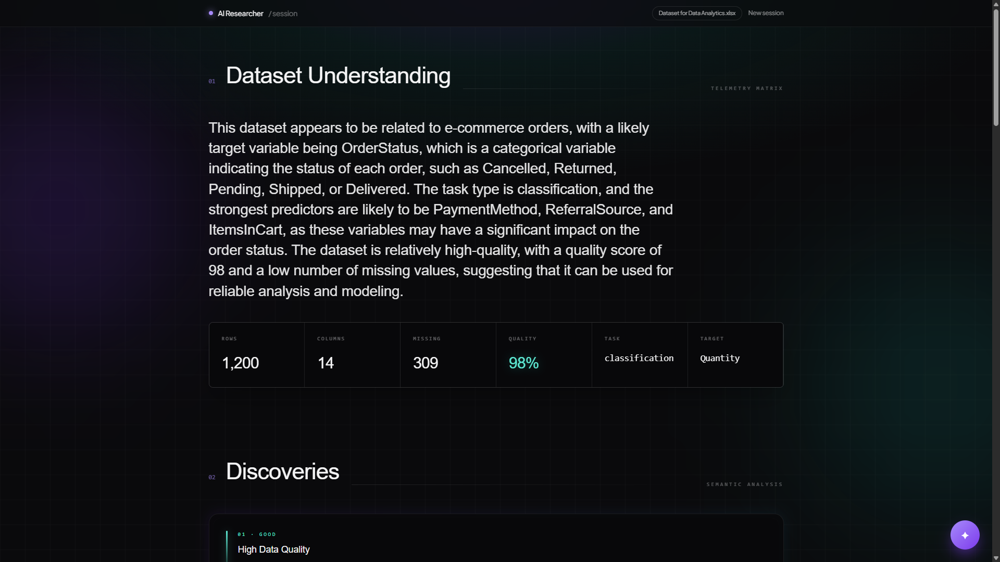
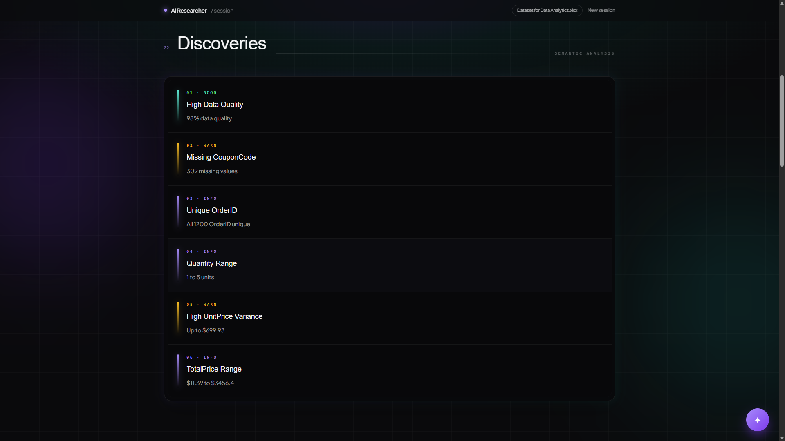
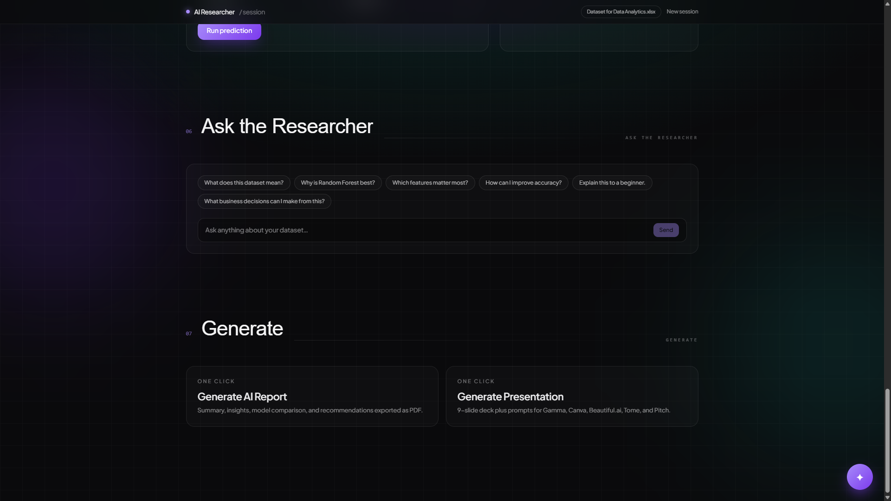

# ClassifyAI

> An interactive, immersive machine learning laboratory and AI data scientist assistant designed to explore, understand, and predict patterns in raw datasets before model training.

**Live Demo**: [ai-classify.vercel.app](https://ai-classify.vercel.app)

---

## Features

- **Cinematic Ingestion Engine**: Support for CSV, Excel (`.xlsx`/`.xls`), JSON, and plain TXT file uploads with animated, real-time data ingestion pipelines.
- **Local Heuristic Machine Learning**: Instant client-side statistical profiling (missing values, quality scores, column-wise distribution calculations) and model comparison running 6 separate heuristic algorithms (Random Forest, XGBoost, Decision Tree, Logistic Regression, KNN, and SVM).
- **Plain-English Explanations**: Seamless integration with LLMs to translate raw statistical outputs and metrics into clean, human-readable insights.
- **Prediction Playground**: Interactive sliding parameters linked to raw feature inputs, allowing users to run mock classification/regression predictions and query the AI on the exact features that drove the output.
- **Ask the Researcher**: An integrated chat terminal console for conversational analysis of data parameters, distributions, and business suggestions.
- **Analytical Exports**: Generates stylized PDF summary reports with stakeholders' summaries via `jsPDF`, alongside 9-slide deck outlines and prompts formatted for popular presentation creators (Gamma, Canva, Pitch, etc.).
- **3D Interactive Graphics**: Visualizes active data networks and attention fields using custom WebGL vertex/fragment shaders inside **Three.js**.

---

## Tech Stack

### Frontend & Routing

- **Core**: React 19 + TypeScript
- **Bundler & Dev Server**: Vite
- **Routing**: TanStack Router (File-based router)
- **State Hydration**: TanStack React Query + React `useSyncExternalStore`
- **Vector Engine**: Three.js (WebGL rendering & shaders)
- **Component Styling**: Tailwind CSS v4 + OKLCH Harmonious Dark Palette
- **UI Components**: Radix UI Primitives

### Backend / Server Functions

- **Server Runtime**: Nitro (TanStack Start server-engine)
- **Utility Libraries**: PapaParse (CSV parsing), SheetJS (XLSX/XLS processing), jsPDF (PDF export)

### AI Models & API

- **AI Infrastructure**: Groq API
- **Primary Model**: Llama 3.3 70B Versatile

### Deployment

- **Target Preset**: Vercel Serverless Functions / Cloudflare Pages

---

## Installation

To run this repository locally, follow these simple setup steps:

```bash
# 1. Clone the repository
git clone https://github.com/decodelabs/classify-ai.git
cd classify-ai

# 2. Install dependencies
npm install

# 3. Configure environment parameters
cp .env.example .env

# 4. Set up local keys
# Open the newly created `.env` file and insert your GROQ_API_KEY.

# 5. Spin up the dev server
npm run dev
```

---

## Environment Variables

| Variable Name  | Required? | Description                                                        | Default / Placeholder    |
| -------------- | --------- | ------------------------------------------------------------------ | ------------------------ |
| `GROQ_API_KEY` | **Yes**   | Groq Cloud API access token for rendering model insights and chat. | `your_groq_api_key_here` |

---

## Video Showcase

Check out the full application walkthrough:
[Watch the ClassifyAI Walkthrough Video](https://kdvhmvy9l6gqbosc.public.blob.vercel-storage.com/ClassifyAi.mp4)

---

## Screenshots

### 1. Landing Page & Neural WebGL Canvas



### 2. Dataset Upload & Ingest Pipeline


### 3. Heuristic Model Rankings



### 4. Interactive Predictions & AI Explainer



---

## Architecture

ClassifyAI uses **TanStack Start**'s full-stack routing context to divide operations between client-side compute and server-side model evaluation:

```
[Uploaded File] ──> [PapaParse / SheetJS] ──> [datasetParser.ts]
                                                     │
                                                     ├── (Local stats & heuristic scoring)
                                                     │
                                                     └── (Groq Chat completion calls)
                                                                 │
                                                                 ▼
[User Interactive UI] <── [datasetStore.ts] <── [groqChat Server Function]
```

1. **Client-Side Parsing**: Large files are chunked, parsed, and converted to numeric distributions directly in the browser to avoid server load.
2. **Deterministic Modeling**: Feature correlation and model score vectors are determined dynamically using seedable pseudorandom logic and covariance calculations.
3. **TanStack Server Functions**: When heavy AI reasoning is requested, `groqChat` triggers a server-side JSON POST request to Groq Cloud, hiding API keys and keys from browser access.

---

## Future Improvements

- **Real WebAssembly Kernels**: Replace client-side heuristic model estimation with native Scikit-Learn/ONNX classifiers compiled to WASM.
- **Chart Visualizations**: Integrate active Recharts components for scatterplots, covariance heatmaps, and ROC curves.
- **Expanded Formats**: Add support for SQLite databases, Parquet files, and direct database endpoints.
- **Multi-Model Pipelines**: Train models locally on the CPU using TensorFlow.js.

---

## License

This project is licensed under the MIT License. See [LICENSE](LICENSE) for details.
