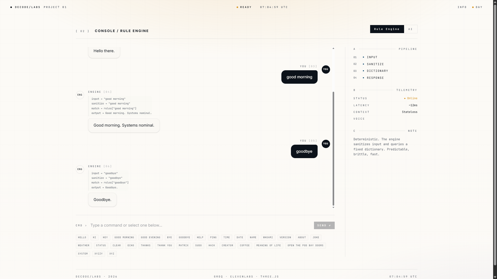

# DecodeBot

> An interactive dual-mode conversational assistant bridging the gap between traditional rule-based logic and modern neural voice AI.

🔗 **Live Demo:** [decodebot.vercel.app](https://decodebot.vercel.app/)

### 🎥 Project Showcase

[](https://kdvhmvy9l6gqbosc.public.blob.vercel-storage.com/decodelabs.mp4)

_(Click the badge above to watch the video demonstration)_

DecodeBot is a product demo showcasing the evolution of conversational interfaces. Within a single UI, users can switch between a deterministic rule-based command dictionary and a modern probabilistic AI assistant featuring real-time speech recognition and text-to-speech voice synthesis.

---

## Features

- **Dual-Mode Evolution Engine**: Toggle instantly between traditional rule execution and modern neural AI.
- **Interactive 3D Visualizer**: Implements a Three.js / React Three Fiber scene reflecting the active conversational mode.
  - **Rule Mode**: Renders a static, rotating wireframe cube with polyhedral details representing structured, rigid logic.
  - **AI Mode**: Renders an interactive, organic pulsing AI orb whose scale and movement react to synthesized voice output.
- **Serverless AI Reasoning**: Utilizes Groq's low-latency endpoints powered by `llama-3.3-70b-versatile` via secure TanStack server functions.
- **Voice Synthesis & Recognition**: Integrates the Web Speech API for real-time speech recognition and ElevenLabs API for high-fidelity voice output.
- **Refined CSS OKLCH Design**: Engineered with a premium ivory/obsidian layout matching industrial console styles.

---

## Tech Stack

- **Frontend**: React 19, TypeScript, Tailwind CSS v4, Framer Motion, Radix UI Primitives, Lucide Icons, Sonner.
- **3D Graphics**: Three.js, React Three Fiber (`@react-three/fiber`), `@react-three/drei`.
- **Backend & Routing**: TanStack Start (file-based routing, server functions, SSR, Vite).
- **AI Models**: Groq (Llama 3.3 70B), ElevenLabs (TTS `eleven_turbo_v2_5`).
- **Development Tooling**: ESLint, Prettier.

---

## Installation

Follow these steps to set up and run DecodeBot locally.

1. **Clone the repository**:

   ```bash
   git clone https://github.com/Decode-Labs/decodebot.git
   cd decodebot
   ```

2. **Install dependencies**:

   ```bash
   npm install
   ```

3. **Configure environment variables**:
   Create a `.env` file in the root directory:

   ```bash
   cp .env.example .env
   ```

   Open the `.env` file and insert your API keys.

4. **Start the development server**:

   ```bash
   npm run dev
   ```

5. **Build for production**:
   ```bash
   npm run build
   ```

---

## Environment Variables

| Variable Name         | Required | Description                                                                                              |
| --------------------- | -------- | -------------------------------------------------------------------------------------------------------- |
| `GROQ_API_KEY`        | **Yes**  | API key to access Groq cloud endpoints. Obtain yours from [Groq Console](https://console.groq.com/keys). |
| `ELEVENLABS_API_KEY`  | **Yes**  | API key to access ElevenLabs speech synthesis. Obtain yours from [ElevenLabs](https://elevenlabs.io/).   |
| `ELEVENLABS_VOICE_ID` | No       | ID of the target ElevenLabs synthesized voice. Defaults to `yIqeesBBd5tdVotHqIzJ` (Rachel).              |

---

## Screenshots

_Screenshots demonstrating the Ivory Light Mode (Deterministic) and Obsidian Dark Mode (AI Voice Module)._

| Rule Engine Mode (Ivory)           | AI Voice Mode (Obsidian)                 |
| ---------------------------------- | ---------------------------------------- |
|  |  |

---

## Architecture

```
                       ┌─────────────────────────┐
                       │   Client UI (React 19)  │
                       └────────────┬────────────┘
                                    │
                  ┌─────────────────┴─────────────────┐
                  ▼                                   ▼
        ┌──────────────────┐                ┌──────────────────┐
        │ Rule Engine Mode │                │   AI Voice Mode  │
        └─────────┬────────┘                └─────────┬────────┘
                  │                                   │
                  ▼ (Local dictionary)                ├───────────────────────┐
       ┌─────────────────────┐                        ▼ (Server Function)     ▼ (Audio Stream)
       │ "hello" -> "Hi" etc │                 ┌─────────────┐         ┌─────────────┐
       └─────────────────────┘                 │  Groq API   │         │ ElevenLabs  │
                                               │ (Llama 3.3) │         │  (TTS API)  │
                                               └─────────────┘         └─────────────┘
```

The application's architecture leverages **TanStack Start**'s server/client boundary:

1. **Server functions (`aiChat`)** securely handle authorization headers and request forwarding to external LLM providers (Groq) without exposing API keys to the browser.
2. **Local proxy routes (`/api/tts`)** stream synthesized speech data back to the client audio controller to bypass CORS policies.
3. **Reactive Three.js bindings** listen to audio playback ticks, feeding voice intensity frequencies directly into R3F mesh scales for real-time visual synchrony.

A complete architectural breakdown is available in [architecture.md](file:///c:/Users/anand/Downloads/decodebot-main/Project1%20-%20DecodeBot/docs/architecture.md).

---

## Future Improvements

- **Local WebGPU Support**: Run a small language model (e.g., Llama-3-8B) client-side using WebGPU for complete privacy and zero network latency.
- **Audio Frequency Analyzer**: Refine the voice pulse to use web audio analyser node frequencies rather than randomized scaling vectors.
- **Expanded Command Pipelines**: Enable customized command chaining and macro definition inside the Rule Engine.

---

## License

Distributed under the MIT License. See [LICENSE](file:///c:/Users/anand/Downloads/decodebot-main/Project1%20-%20DecodeBot/LICENSE) for details.
