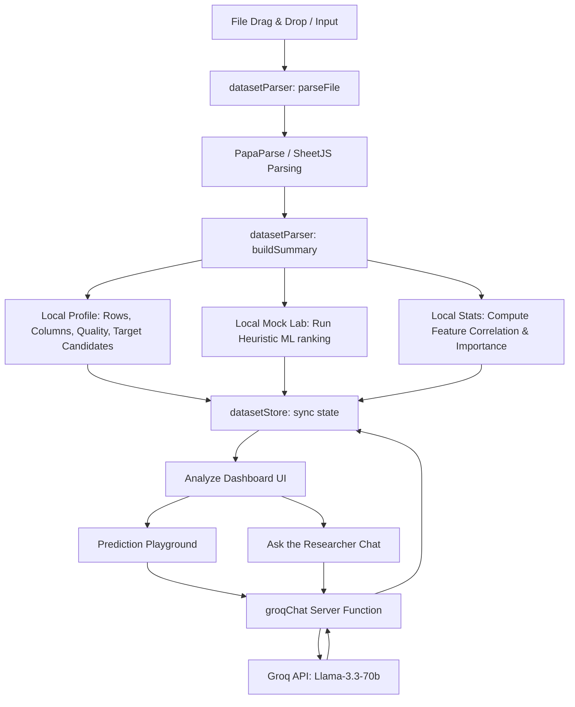

# ClassifyAI Architecture

This document describes the technical architecture and data flows of the ClassifyAI codebase.

## System Topology

ClassifyAI is designed as a hybrid full-stack React application powered by **TanStack Start**, **Vite**, and the **Nitro** server engine. It operates primarily client-side for data parsing and heuristic profiling, calling server functions for AI synthesis.

---

## Component Roles

### 1. Ingestion and Profiling (`src/lib/datasetParser.ts`)

- **Data Parsing**: Supports CSV, Excel (`.xlsx`/`.xls`), JSON, and plain TXT file types. XLS parsing is handled via SheetJS (`xlsx`) in-memory, while CSV is processed by PapaParse.
- **Statistical Profiling**: Automatically determines column data types (numeric, categorical, boolean, date, text) based on value distributions. It computes null value counts, mean, standard deviation, bounds, and quality metrics.
- **Target Identification**: Scans header tags for common labels (`target`, `class`, `churn`, `label`, `y`) to suggest classification/regression candidates.
- **Mock ML Laboratory**: Simulates model cross-validation score vectors using seedable pseudorandom logic based on dataset size and feature entropy.

### 2. Global State Sync (`src/lib/datasetStore.ts`)

- Implements a custom external store hook via React's `useSyncExternalStore` primitive.
- Shares parsed dataset profiles, calculated stats, prediction outcomes, and LLM generated insights globally across routes without causing full-page rerenders.

### 3. Server Functions (`src/lib/groq.functions.ts`)

- Exposes a TanStack Start `createServerFn` that parses requests via `zod`.
- Acts as a secure bridge to execute HTTP fetches to the Groq Chat completion endpoint (`api.groq.com`), keeping secret credentials hidden from client-side bundles.

### 4. Graphic Visualizations (`src/components/sections/NeuralScene.tsx`)

- Uses **Three.js** to construct a WebGL-based particles field mapping to neural connections.
- Manipulates WebGL attributes directly via custom vertex and fragment shaders. deforming geometry vectors with sinusoids representing active training noise.

---

## Key Data Flows

### Ingestion to Insights

1. **Drop Event**: The user drops a CSV file on the homepage.
2. **Parsing**: `parseFile()` parses the text locally in the browser and constructs a `DatasetSummary` containing stats and a 5-row sample.
3. **Modeling**: `runModelLab()` and `computeFeatureImportance()` calculate scores and feature weight arrays.
4. **Hydration**: The data is loaded into `datasetStore`, and the router routes the user to `/analyze`.
5. **Background Call**: The dashboard triggers concurrent background server function calls (`runGroqUnderstanding` and `runGroqInsights`).
6. **Completion**: The LLM analyzes the dataset schema JSON and populates the dashboard with a narrative summary and 4-6 specific data findings.
